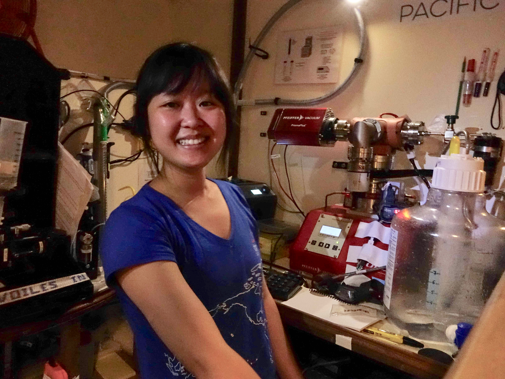
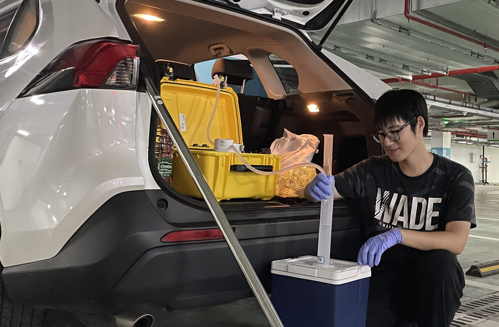
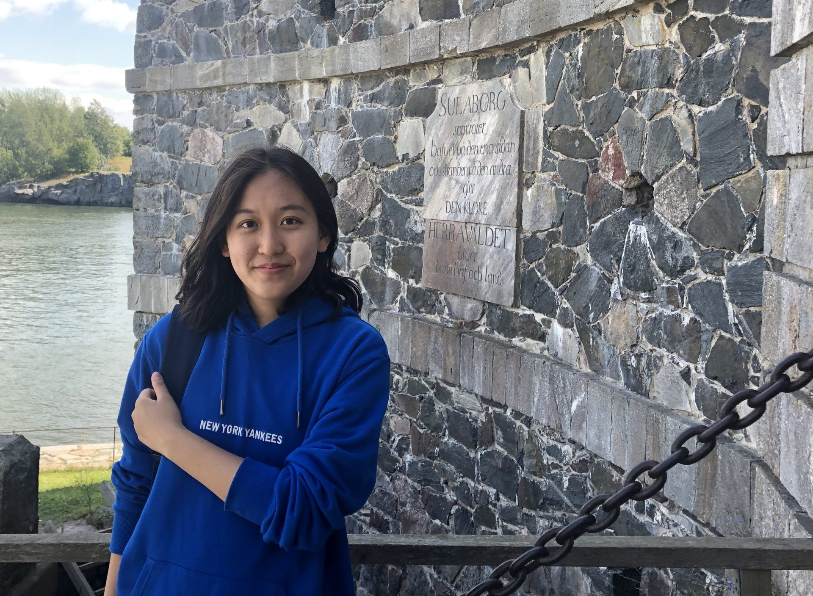

## Principle investigator
Yajuan Lin (Assistant Professor, Marine Ecology)

 

## Current lab members

- Merlin Miao (DKU undergrad student, class of 2023)

 

- Yiyang Weng (DKU undergrad student, class of 2023)

 

- Yunyi Ru (DKU undergrad student, class of 2023) 

## Former lab members

- Wendy Wen (Undergraduate researcher 2020-2022, now graduate student at Duke)

- Lihan Huang (Undergraduate researcher 2020-2022, now graduate student at Stanford)

- Cutong Fang (Undergraduate researcher 2020-2022, now graduate student at UC Berkeley)

- Xiuwen Li (Research Assistant 2021-2022)

- Yuchen Meng (visiting PhD student from DESS at Tsinghua University 2021)
